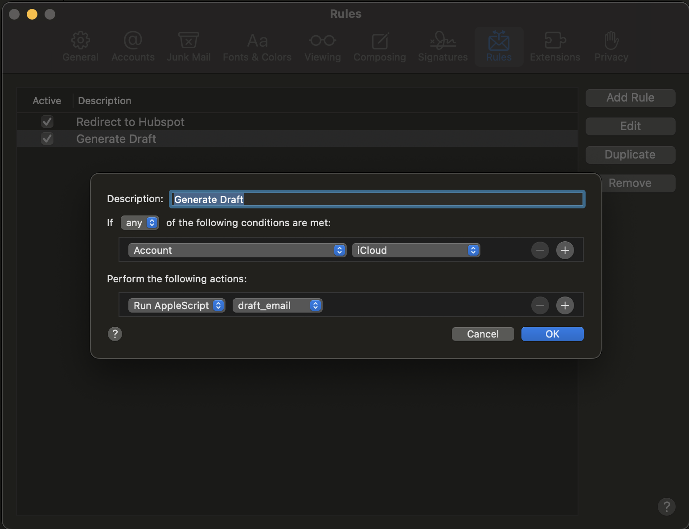

# Draft My Email 📧

This is a small project dedicated to improving email conversations. This project will help you automatically generate draft for new emails in your inbox.

This is a work in progress and all contributes are more than welcome.

> This is compatible with Apple Mail only

# Installation

1. [Install Ollama](https://ollama.ai/download)
2. After installing ollama download llama2: 
    ```bash
    ollama run llama2 "Hello World!"
    ```
3. Clone this repository
4. Move into the project folder and run `./setup.sh`: This will create a copy of the script required to run the project and configure it with your local path.
5. Setup Apple Mail Rules:
    a. In Apple Mail to go `Mail -> Settings > Rules > Add Rule`
    b. Description: Generate Draft (or whatever you want)
    c. In the first box select your trigger, the easiest is to trigger for a particular Account.
    d. Below perform the following actions select: `Run Applescript` and select `draft_email`.
    e. Save. Done

6. To test it, right click on any email in your selected account and click `Apply Rules`




# Open Issues

* Multiple mails will trigger models in parallel and it can considerably slow your machine.
* Chains do not preserve the last model.
* Llama2 is not GPT-4 and sometimes the answers are not very good
